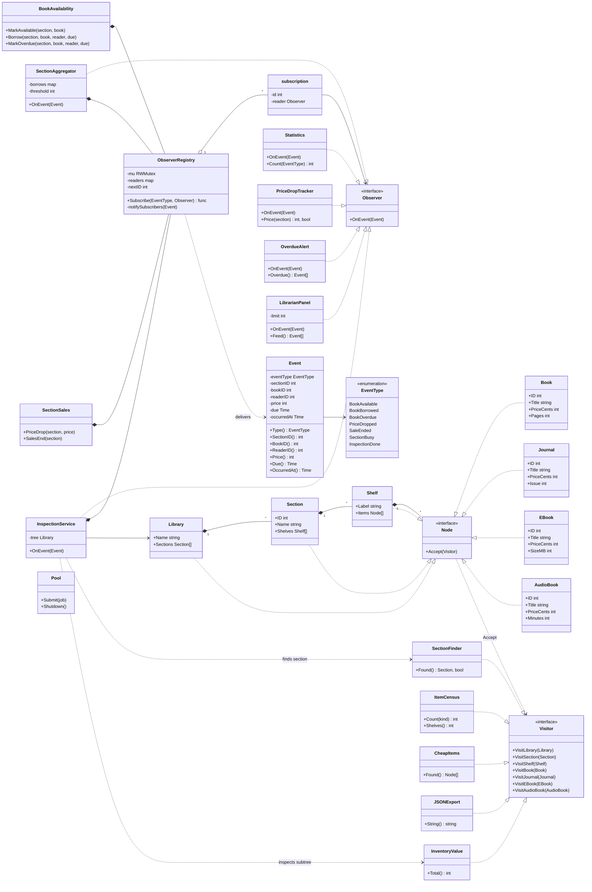

# E-Library: Observer and Visitor

```mermaid
classDiagram
    direction LR

    class Observer {
        <<interface>>
        +OnEvent(Event)
    }
    class Event {
        -eventType EventType
        -sectionID int
        -bookID int
        -readerID int
        -price int
        -due Time
        -occurredAt Time
        +Type() EventType
        +SectionID() int
        +BookID() int
        +ReaderID() int
        +Price() int
        +Due() Time
        +OccurredAt() Time
    }
    class EventType {
        <<enumeration>>
        BookAvailable
        BookBorrowed
        BookOverdue
        PriceDropped
        SaleEnded
        SectionBusy
        InspectionDone
    }
    class ObserverRegistry {
        -mu RWMutex
        -readers map
        -nextID int
        +Subscribe(EventType, Observer) func
        -notifySubscribers(Event)
    }
    class subscription {
        -id int
        -reader Observer
    }

    class BookAvailability {
        +MarkAvailable(section, book)
        +Borrow(section, book, reader, due)
        +MarkOverdue(section, book, reader, due)
    }
    class SectionSales {
        +PriceDrop(section, price)
        +SalesEnd(section)
    }
    class SectionAggregator {
        -borrows map
        -threshold int
        +OnEvent(Event)
    }
    class InspectionService {
        -tree Library
        +OnEvent(Event)
    }
    class Statistics {
        +OnEvent(Event)
        +Count(EventType) int
    }
    class PriceDropTracker {
        +OnEvent(Event)
        +Price(section) int, bool
    }
    class OverdueAlert {
        +OnEvent(Event)
        +Overdue() Event[]
    }
    class LibrarianPanel {
        -limit int
        +OnEvent(Event)
        +Feed() Event[]
    }
    class Pool {
        +Submit(job)
        +Shutdown()
    }

    class Node {
        <<interface>>
        +Accept(Visitor)
    }
    class Visitor {
        <<interface>>
        +VisitLibrary(Library)
        +VisitSection(Section)
        +VisitShelf(Shelf)
        +VisitBook(Book)
        +VisitJournal(Journal)
        +VisitEBook(EBook)
        +VisitAudioBook(AudioBook)
    }
    class Library {
        +Name string
        +Sections Section[]
    }
    class Section {
        +ID int
        +Name string
        +Shelves Shelf[]
    }
    class Shelf {
        +Label string
        +Items Node[]
    }
    class Book {
        +ID int
        +Title string
        +PriceCents int
        +Pages int
    }
    class Journal {
        +ID int
        +Title string
        +PriceCents int
        +Issue int
    }
    class EBook {
        +ID int
        +Title string
        +PriceCents int
        +SizeMB int
    }
    class AudioBook {
        +ID int
        +Title string
        +PriceCents int
        +Minutes int
    }
    class InventoryValue {
        +Total() int
    }
    class ItemCensus {
        +Count(kind) int
        +Shelves() int
    }
    class CheapItems {
        +Found() Node[]
    }
    class JSONExport {
        +String() string
    }
    class SectionFinder {
        +Found() Section, bool
    }

    Statistics ..|> Observer
    PriceDropTracker ..|> Observer
    OverdueAlert ..|> Observer
    LibrarianPanel ..|> Observer
    SectionAggregator ..|> Observer
    InspectionService ..|> Observer

    BookAvailability *-- ObserverRegistry
    SectionSales *-- ObserverRegistry
    SectionAggregator *-- ObserverRegistry
    InspectionService *-- ObserverRegistry
    ObserverRegistry "1" o-- "*" subscription
    subscription --> Observer
    ObserverRegistry ..> Event : delivers
    Event --> EventType

    InspectionService --> Library
    InspectionService ..> SectionFinder : finds section
    InspectionService ..> InventoryValue : inspects subtree

    Node <|.. Library
    Node <|.. Section
    Node <|.. Shelf
    Node <|.. Book
    Node <|.. Journal
    Node <|.. EBook
    Node <|.. AudioBook
    Library "1" *-- "*" Section
    Section "1" *-- "*" Shelf
    Shelf "1" *-- "*" Node
    Node ..> Visitor : Accept

    InventoryValue ..|> Visitor
    ItemCensus ..|> Visitor
    CheapItems ..|> Visitor
    JSONExport ..|> Visitor
    SectionFinder ..|> Visitor
```
